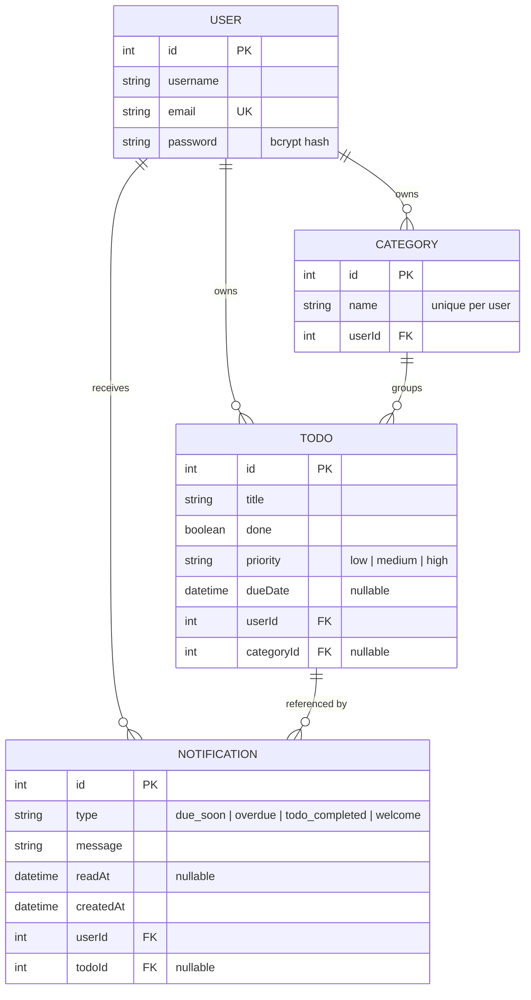

# Task Management API

A REST API for managing personal tasks, built with **NestJS**, **TypeORM** and
**SQLite**. Users register, receive a JWT, and manage their own todos grouped
into categories, with filtering, sorting and pagination.

The database is an embedded file, so there is no database server to install:
clone, `npm install`, `npm run start:dev`.

---

## Contents

- [Quick start](#quick-start)
- [Configuration](#configuration)
- [API reference](#api-reference)
- [Architecture](#architecture)
- [Data model](#data-model)
- [Testing](#testing)
- [Security notes](#security-notes)
- [Known limitations](#known-limitations)

---

## Quick start

Requires **Node.js 20 or newer** (developed on Node 24).

```bash
git clone <repository-url>
cd 03-university-project
npm install

cp .env.example .env
# then set JWT_SECRET, e.g.
node -p "require('crypto').randomBytes(32).toString('hex')"

npm run start:dev
```

The API is then at <http://localhost:3000/api/v1> and interactive
documentation at <http://localhost:3000/api/docs>.

Migrations run automatically at start-up, so the database file is created and
brought up to date on first launch.

### Trying it out

The quickest path is the Swagger UI: open `/api/docs`, call
`POST /auth/signup`, copy the `accessToken` from the response, press
**Authorize**, and paste it in. Every other endpoint then works from the page.

By hand:

```bash
# register and capture the token
TOKEN=$(curl -s -X POST http://localhost:3000/api/v1/auth/signup \
  -H 'Content-Type: application/json' \
  -d '{"username":"ann","email":"ann@example.com","password":"password123"}' \
  | python3 -c "import sys,json;print(json.load(sys.stdin)['accessToken'])")

# create a category and a todo in it
CATEGORY=$(curl -s -X POST http://localhost:3000/api/v1/categories \
  -H "Authorization: Bearer $TOKEN" -H 'Content-Type: application/json' \
  -d '{"name":"University"}' | python3 -c "import sys,json;print(json.load(sys.stdin)['id'])")

curl -s -X POST http://localhost:3000/api/v1/todos \
  -H "Authorization: Bearer $TOKEN" -H 'Content-Type: application/json' \
  -d "{\"title\":\"write thesis\",\"priority\":\"high\",\"categoryId\":$CATEGORY}"

# list, filtered and sorted
curl -s "http://localhost:3000/api/v1/todos?priority=high&sortBy=dueDate&order=ASC" \
  -H "Authorization: Bearer $TOKEN"
```

### Scripts

| Script | What it does |
| --- | --- |
| `npm run start:dev` | Start in watch mode |
| `npm run start:prod` | Run the compiled build (`npm run build` first) |
| `npm test` | Run every test — unit and end-to-end |
| `npm run test:unit` | Unit tests only |
| `npm run test:e2e` | End-to-end tests only |
| `npm run test:cov` | Tests with a coverage report |
| `npm run lint` | ESLint with `--fix` |
| `npm run build` | Compile to `dist/` |
| `npm run typeorm:run-migrations` | Apply migrations by hand |
| `npm run typeorm:generate-migration --name=Foo` | Generate one from entity changes |
| `npm run typeorm:revert-migration` | Roll the last migration back |

---

## Configuration

Configuration comes from `.env` (see `.env.example`). It is validated at
start-up by `src/config/env.validation.ts`, so a missing or too-short secret
fails immediately rather than on the first login.

| Variable | Required | Default | Meaning |
| --- | --- | --- | --- |
| `JWT_SECRET` | **yes** | — | Signing key for access tokens; at least 16 characters |
| `JWT_EXPIRES_IN` | no | `1d` | Token lifetime, e.g. `3600s`, `12h`, `7d` |
| `DATABASE_PATH` | no | `data/university-project.sqlite` | SQLite file; `:memory:` for an ephemeral database |
| `PORT` | no | `3000` | Port to listen on |
| `DUE_SOON_WINDOW_HOURS` | no | `24` | How far ahead a todo's due date counts as "due soon" |

`.env` is git-ignored. Only `.env.example` is committed.

---

## API reference

Base path `/api/v1`. Everything except signup and login needs
`Authorization: Bearer <token>`.

### Authentication

| Method | Path | Purpose |
| --- | --- | --- |
| `POST` | `/auth/signup` | Create an account, returns the user and a token |
| `POST` | `/auth/login` | Exchange credentials for a token |

### Users

| Method | Path | Purpose |
| --- | --- | --- |
| `GET` | `/users/me` | The authenticated user |
| `PATCH` | `/users/me` | Update username, email or password |

Changing the password requires `oldPassword` in the same request.

### Categories

| Method | Path | Purpose |
| --- | --- | --- |
| `GET` | `/categories` | List your categories |
| `POST` | `/categories` | Create one |
| `GET` | `/categories/:id` | Fetch one |
| `PATCH` | `/categories/:id` | Rename one |
| `DELETE` | `/categories/:id` | Delete one; its todos are kept and detached |

Category names are unique per user, so two users may both have `Personal`.

### Todos

| Method | Path | Purpose |
| --- | --- | --- |
| `GET` | `/todos` | List, with filtering, sorting and pagination |
| `POST` | `/todos` | Create one |
| `GET` | `/todos/:id` | Fetch one |
| `PATCH` | `/todos/:id` | Update one |
| `DELETE` | `/todos/:id` | Delete one (`204`) |

`GET /todos` accepts:

| Parameter | Type | Default | Notes |
| --- | --- | --- | --- |
| `page` | integer ≥ 1 | `1` | |
| `limit` | integer 1–100 | `10` | Capped so one request cannot read the whole table |
| `done` | boolean | — | |
| `priority` | `low` \| `medium` \| `high` | — | |
| `categoryId` | integer | — | |
| `search` | string | — | Case-insensitive substring of the title |
| `sortBy` | `id` \| `title` \| `done` \| `priority` \| `dueDate` | `id` | Restricted to this list |
| `order` | `ASC` \| `DESC` | `ASC` | |

It returns an envelope:

```json
{
  "data": [
    {
      "id": 1,
      "title": "write thesis",
      "done": false,
      "priority": "high",
      "dueDate": "2026-10-01T09:00:00.000Z",
      "category": { "id": 1, "name": "University" }
    }
  ],
  "total": 1,
  "page": 1,
  "limit": 10,
  "totalPages": 1
}
```

### Notifications

| Method | Path | Purpose |
| --- | --- | --- |
| `GET` | `/notifications` | List, with filtering and pagination |
| `PATCH` | `/notifications/:id/read` | Mark one read |
| `PATCH` | `/notifications/read-all` | Mark all unread ones read, returns `{ "updated": number }` |
| `DELETE` | `/notifications/:id` | Delete one (`204`) |

A notification is created when: a todo's due date is within
`DUE_SOON_WINDOW_HOURS` (`due_soon`); a todo's due date has passed and it is
still not done (`overdue`); a todo is marked done (`todo_completed`); or an
account is created (`welcome`). The due-date checks run on a schedule (every
five minutes) rather than being triggered by a request — the only logic in
this codebase that runs outside one.

`GET /notifications` accepts:

| Parameter | Type | Default | Notes |
| --- | --- | --- | --- |
| `page` | integer ≥ 1 | `1` | |
| `limit` | integer 1–100 | `10` | |
| `unreadOnly` | boolean | — | |
| `type` | `due_soon` \| `overdue` \| `todo_completed` \| `welcome` | — | |

Same pagination envelope as `GET /todos`:

```json
{
  "data": [
    {
      "id": 1,
      "type": "due_soon",
      "message": "\"write thesis\" is due soon",
      "readAt": null,
      "createdAt": "2026-09-03T08:00:00.000Z",
      "todo": { "id": 4 }
    }
  ],
  "total": 1,
  "page": 1,
  "limit": 10,
  "totalPages": 1
}
```

`todo` is `null` for a `welcome` notification. There is no `GET
/notifications/:id` — list-and-toggle-read is the whole requirement, unlike
Todos/Categories, which are primary editable resources.

### Status codes

| Code | When |
| --- | --- |
| `400` | Validation failed, or an unknown property was sent |
| `401` | Missing/invalid token, or wrong credentials |
| `404` | The resource does not exist **or does not belong to you** |
| `409` | Email already registered, or duplicate category name |

---

## Architecture

```
src/
├── auth/           JWT strategy, guard, login/signup
├── users/          user entity, profile routes
├── todos/          todo entity, querying
├── categories/     category entity
├── notifications/  notification entity, in-app event log, due-date scan
├── config/         database options, environment validation
├── migrations/     schema history, listed explicitly in index.ts
├── decorators/     @CurrentUser()
├── interceptors/   @Serialize(Dto)
├── app.setup.ts    prefix + validation, shared by main.ts and the tests
└── main.ts
```

Each feature is a NestJS module owning its entity, service and controller.
Controllers handle HTTP only; all rules live in the services, which is what
makes them straightforward to unit test. `NotificationsService` is the one
exception with a method that isn't request-driven: `scanDueDates` also runs
on a `@Cron()` schedule, but the scheduled method is a one-line wrapper around
a plain, directly-callable method, so it's tested the same way as everything
else — by calling it and asserting on the result, not by mocking a timer.

Two pieces are worth pointing out:

**`@Serialize(Dto)`** (`src/interceptors/serialize.interceptor.ts`) runs every
response through a DTO, so a field is returned only if that DTO marks it
`@Expose()`. This is why a password hash cannot reach a client even though the
entity carries one.

**`@CurrentUser()`** (`src/decorators/current-user.decorator.ts`) injects the
user that `JwtStrategy` resolved for the request, so controllers never read the
identity out of the URL or body.

---

## Data model



Deleting a user cascades to their todos, categories and notifications.
Deleting a category sets its todos' `categoryId` to `NULL`, so tasks are never
lost by tidying up categories — but deleting a todo cascades to its
notifications, since a notification about a todo that no longer exists has no
value.

Schema changes are made through migrations (`src/migrations/`), never
`synchronize`, so the schema history is reviewable and reversible.

---

## Testing

```bash
npm test          # 88 tests: unit + end-to-end
npm run test:cov  # with coverage (~95% of statements)
```

**Unit tests** mock the repository and cover service decisions in isolation:
password hashing, duplicate detection, owner scoping, query construction and
priority ranking. The due-date scan is tested the same way — a fixed `now` is
passed directly to `scanDueDates`, so its unit tests need no real waiting and
never touch the scheduler.

**End-to-end tests** drive the real application over HTTP against a fresh
in-memory SQLite database per file. Because the schema is created by running
the migrations, every test run also verifies that the migrations apply
cleanly. The notifications e2e suite triggers the due-date scan directly
(`app.get(NotificationsService).scanDueDates()`) rather than waiting for the
cron tick.

Both bugs described below have explicit regression tests, so they cannot
return unnoticed.

---

## Security notes

Two vulnerabilities were found in an earlier version of this project and are
fixed. They are documented here because the fixes shaped the current design.

**1. Insecure direct object reference on todos.** The service looked resources
up by id alone, so any logged-in user could read, change or delete another
user's todos by guessing an id. Every service method is now scoped to an owner
id, and a resource belonging to someone else returns **404 rather than 403** —
a 403 would confirm that the id exists and let a caller enumerate other
people's data. This isn't a todos-specific patch; it's the standing rule every
resource added since (categories, notifications) follows from the start.

**2. Unauthenticated password overwrite.** `PATCH /users/:id` had no guard, and
the old-password check ran only when `oldPassword` was present. A request that
simply omitted it skipped the check and wrote the new password to the database
unhashed. The route is now `PATCH /users/me`, taking identity from the token,
and `oldPassword` is required whenever `password` is present — enforced in the
DTO *and* re-checked in the service, because validation is a convenience for
the caller rather than the security boundary.

Other measures in place:

- passwords are stored as bcrypt hashes with a per-user salt, and never
  appear in a response
- login answers identically for an unknown email and a wrong password, so it
  cannot be used to discover which addresses have accounts
- the JWT strategy re-reads the user on each request, so a deleted account
  stops working immediately instead of remaining valid until its token expires
- `whitelist` and `forbidNonWhitelisted` validation reject unknown properties
  rather than silently ignoring them
- `sortBy` is restricted to a fixed list before reaching the query builder,
  and `limit` is capped at 100
- the signing secret comes from the environment and is validated at start-up;
  `.env` is git-ignored

---

## Known limitations

Honest notes on what this project does not do.

- **No refresh tokens.** Access tokens live for `JWT_EXPIRES_IN` and there is
  no revocation list; signing out is a client-side matter of discarding the
  token.
- **No rate limiting** on login, so it offers no protection against
  brute-force guessing. `@nestjs/throttler` would be the natural fix.
- **Due-date notifications can lag up to five minutes** behind the actual
  threshold crossing, since the scan runs on a fixed schedule rather than
  reacting to time passing. A todo whose due date moves after a reminder was
  already sent gets a fresh reminder on the next scan, since the old one is
  cleared — but an already-read reminder is cleared too, so it won't remain as
  history once that happens.
- **SQLite** suits a single-process application. Concurrent writers would be a
  reason to move to PostgreSQL; the repository layer would not change, only
  `src/config/database.config.ts` and the migration dialect.
- **Dependency advisories are clean today, not forever.** `npm audit` reports
  zero vulnerabilities as of the last update, but that is a statement about a
  moment in time; re-run it before submitting.
- **Jest needs `--experimental-vm-modules`** because NestJS 12 is ESM-only.
  The flag is applied by the npm scripts, so `npm test` works as-is.
